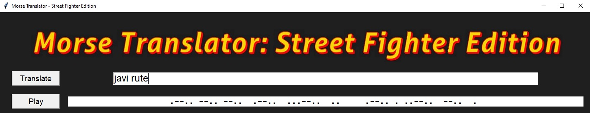

# Morse_code_translator_Street_Fighter_Edition

This extremely useful and potentially life-saving app takes the user input and converts it into morse code, using Street Fighter punch sounds.

It's a GUI app built on Python with Tkinter.

